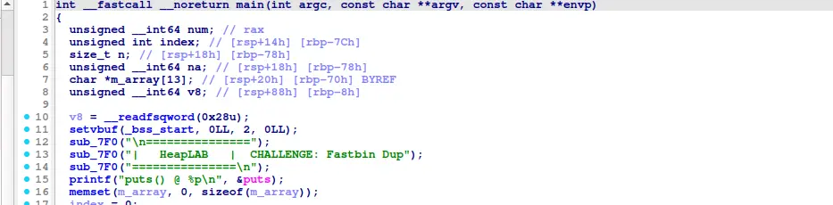

the challenge provide no target, which mean that the target is spawning a shell

the challenge provide puts@glibc, thus guilding us toward using one glibc gadget to spawn a shell

looking at the libc, we discover a gadget that take values from Irsp+0x50|... as argv, which is in our array of heap pointer, which meant that we can freely control the argv by editing the heap

with that, we can spawn a shell by using "/bin/sh -s ...." with "-s" to eliminate trash argv 