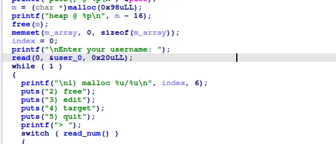
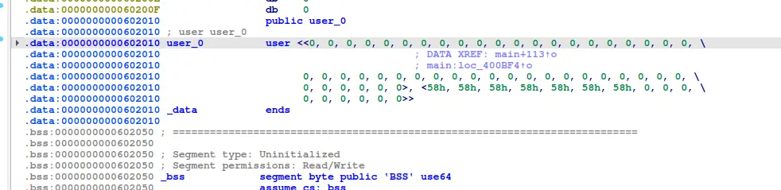

the username is above our target, by which we can forge a fake freed chunk, as we can edit 0x20 bytes

with the free heap and libc leak, we can link our fake chunk to a freed chunk on the heap that belong to a small bin