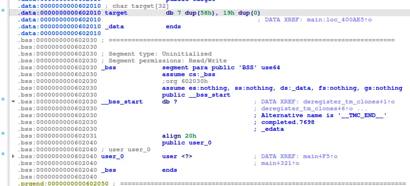
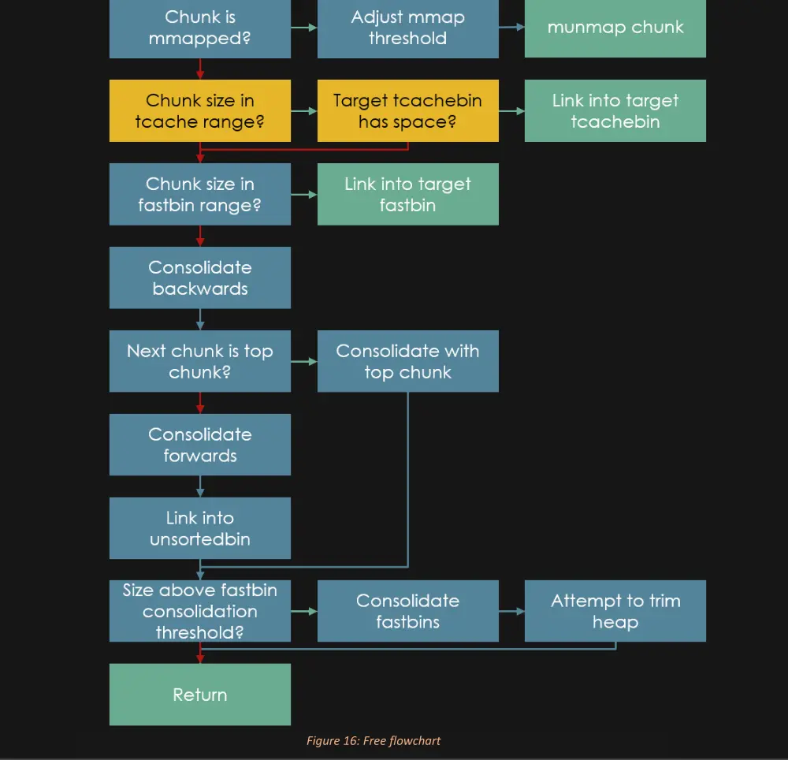

the challenge let us malloc 4 fast chunks other chunks, while also letting us modify the "age" variable, which is in user0, slightly below our target

we are allowed to read 0x10 bytes when the malloc option is used

with that, we can commit a fastbin_dup to link our a fake chunk with the age as the size field to the fastbin 

then we can trigger consolidate fast bin to push our fake chunk into unsorted bin by freeing the chunk that border the top chunk 

after growing the max_size of the arena by malloc a bunch of 0x20000 chunk, we can then try to change our fake chunk to size 0x80000, and request a chunk of 0x80010 so that our chunk is in the largest largebin, a bin without maximum size request 

then, by cha
