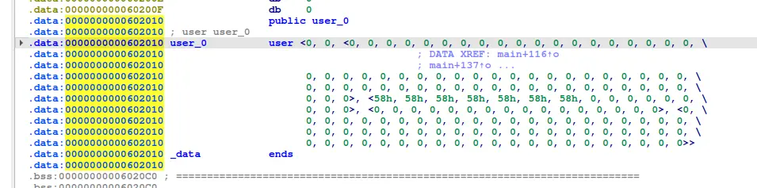
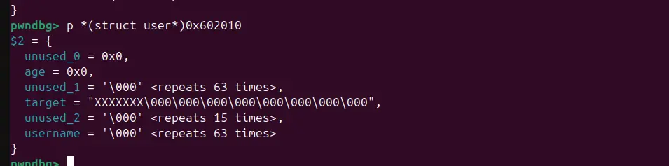
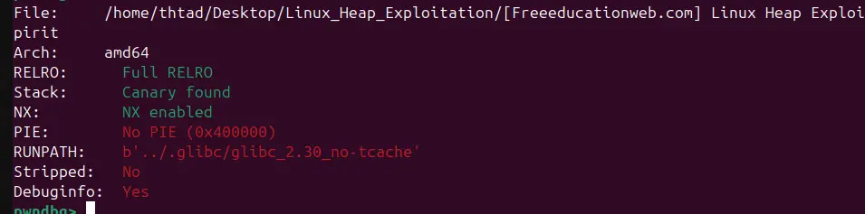
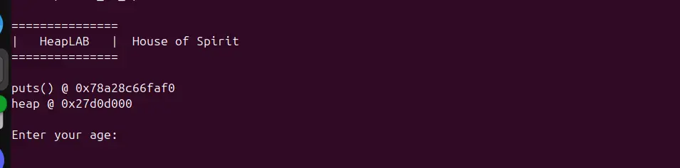

the 'user' age and username sandwich our target

as the binary contains no pie, and we got a free heap and libc leak, we can forge a valid fake chunk 

and because we can abuse an overflow bug to change the pointer of the malloc'ed chunk, we can free our fake chunk, and malloc it again to overwrite our target

