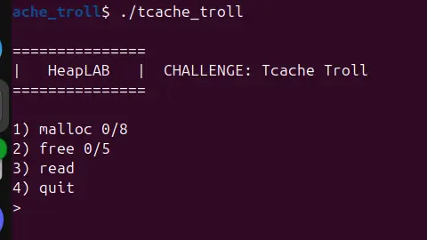
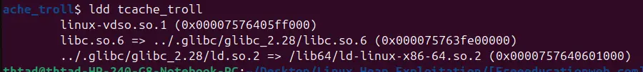

the binary allow us to malloc 8 times, and free 5 times amd read unfreed chunks

fortunately, the binary use libc 2.28, which allows us to double free into tcache bins

because the pointer of freed chunk are not deleted, we can read those freed chunk by having a non-freed chunk (based on the in_use bit of the program) overlap a freed chunk (based on the in_use bit), thus allow us to leak heap_base 

